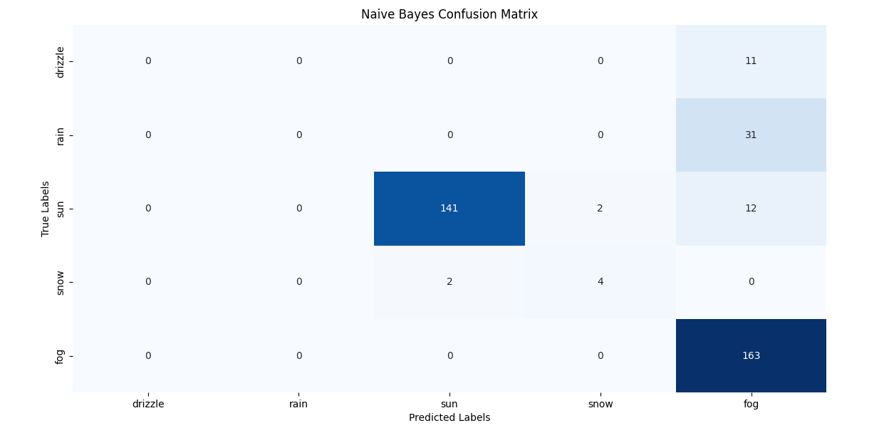
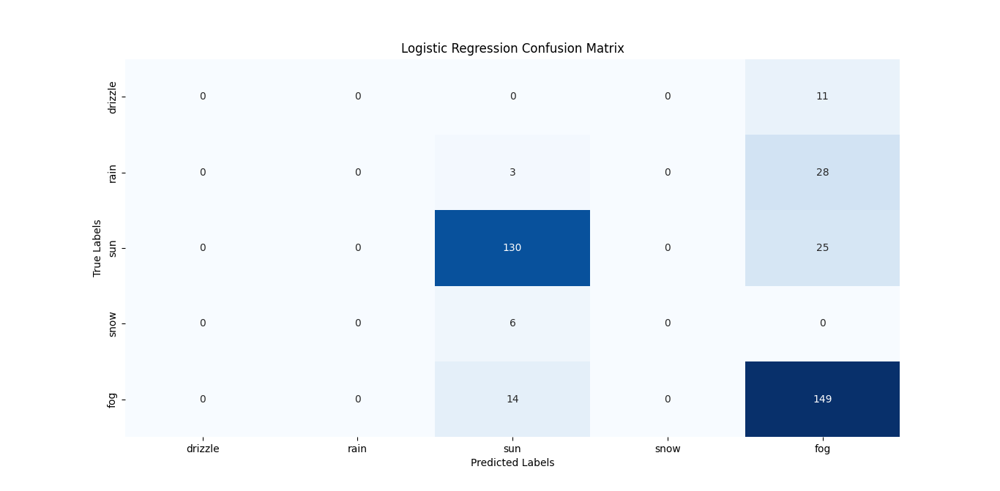
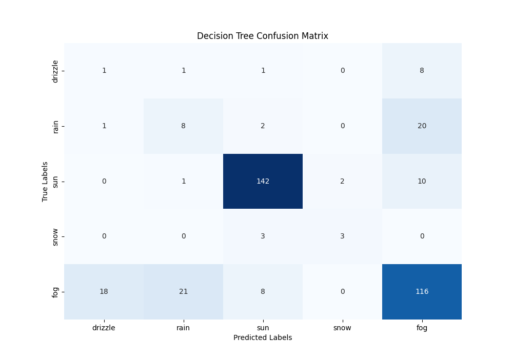
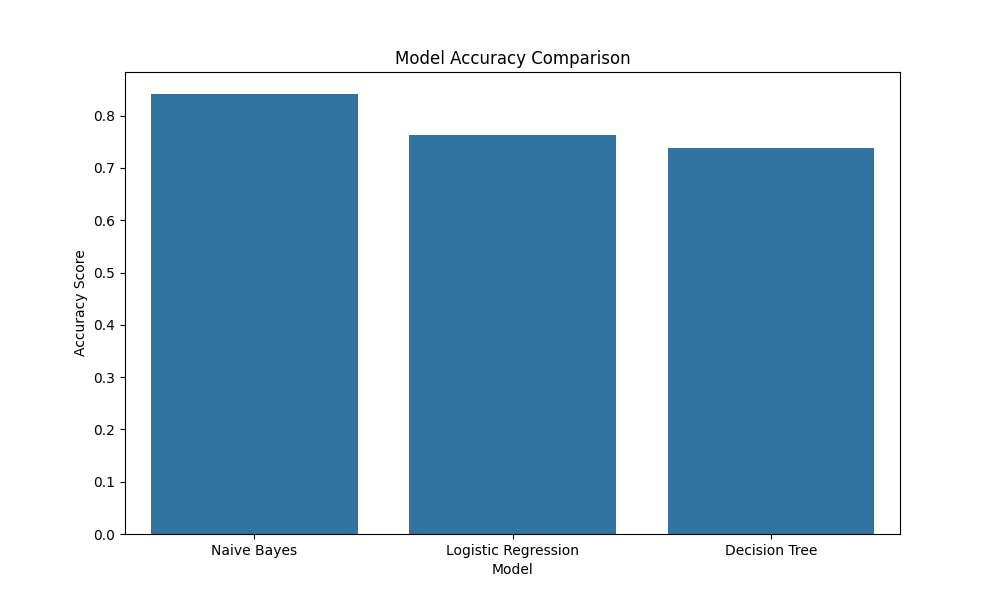

# Weather Classification Model

This project uses machine learning models to classify weather based on Seattle's weather dataset. The models being compared include Naive Bayes, Logistic Regression, and Decision Tree.

## Steps to Execute

1. **Install Required Libraries:**

   To run this project, you need to install the following Python libraries:
   ```sh
   pip install pandas matplotlib seaborn scikit-learn
   ```
2. **Prepare the Data:**

   The data is downloaded from the file ```seattle-weather.csv``` on Kaggle. This file contains weather parameters and weather labels.

3. **Preprocess the Data:**

   * Remove unnecessary columns (```weather```, ```date```).
   * Split the data into training and testing sets (test_size=0.25).
   * Standardize the data using ```StandardScaler```.

4. **Train the Models:**

   Train three machine learning models:
   * Naive Bayes (GaussianNB):
     - **Description:** The Naive Bayes model is based on Bayes' theorem with the assumption of independence between features.
     - **Advantages:** Simple, efficient with large datasets, and requires minimal computational resources.
     - **Disadvantages:** The independence assumption may not always be accurate, affecting performance in some cases.
   * Logistic Regression (LogisticRegression)
     - **Description:** The logistic regression model is used to predict the probability of classes based on input features.
     - **Advantages:** Easy to understand, implement, and provides probability predictions.
     - **Disadvantages:** May not perform well if the relationships between features are nonlinear.
   * Decision Tree (DecisionTreeClassifier)
      - **Description:** Decision trees create classification rules by splitting data based on features.
      - **Advantages:** Easy to interpret, does not require data normalization, and can handle nonlinear relationships.
      - **Disadvantages:** Prone to overfitting if not properly pruned, sensitive to small variations in the data.

5. **Model Evaluation**
   * Calculate the accuracy (accuracy_score) for each model.
   * Predict results for a new dataset.
     ```sh
     data_need_to_predict = [5.6, 10.0, 8.5, 3.4]
     Naive Bayes Prediction: ['rain']
     Logistic Regression Prediction: ['rain']
     Decision Tree Prediction: ['rain']
     ```
   * Display the confusion matrix (confusion_matrix) for each model.
     
     
     
   * Compare the accuracy of the models using a bar chart.
    

## Running the Project:
   * Ensure you have installed all the required libraries.
   * Place the ```seattle-weather.csv``` file in the same directory as the Python script.
   * Run the Python script:
   ```sh
   python your_script_name.py
   ```

## References:
   * [Pandas Documentation]()
   * [Matplotlib Documentation]()
   * [Seaborn Documentation]()
   * [Scikit-Learn Documentation]()